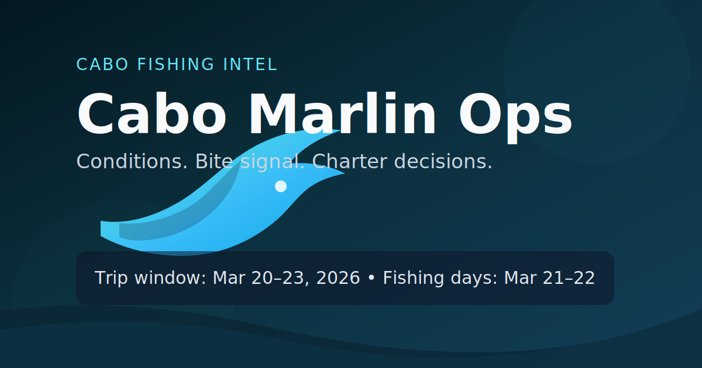

# Cabo Marlin Ops

Cabo Marlin Ops is a static, mobile-first operations dashboard for a Cabo fishing trip window (`2026-03-20` to `2026-03-23`, fishing days `2026-03-21` and `2026-03-22`).

The browser only reads local JSON files under `public/data`. All scraping and external fetching runs server-side in GitHub Actions.

[Review app](https://evbarleyg.github.io/cabo-marlin-ops/)

## Preview Card



## In-App Navigation

- `/` how-to front page (workflow + interpretation guide)
- `/dashboard` operational snapshot
- `/conditions` forecast charts + estimated bite propensity heat overlay
- `/bite` timeline + season-relative bite context
- `/charters` shortlist and quote templates
- `/settings` units/theme/base coordinates

## Stack

- Vite + React + TypeScript
- TailwindCSS + shadcn-style component structure
- Recharts
- Leaflet + OpenStreetMap tiles
- Zod data validation
- React Router (`BrowserRouter` with GitHub Pages base path)

## Local Development

```bash
npm ci
npm run fetch:data
npm run test:parsers
npm run build
npm run dev
```

Default app URL in dev: `http://localhost:5173`

## Data Refresh Architecture

### Runtime model

- Browser runtime: loads only local files:
  - `public/data/conditions.json`
  - `public/data/biteReports.json`
  - `public/data/charters.seed.json`
  - `public/data/charters.json`
- Server-side refresh: `scripts/fetchData.ts` (Node 20) runs in GitHub Actions.

### Scheduled refresh

Workflow: `.github/workflows/deploy.yml`

- Triggers:
  - manual (`workflow_dispatch`)
  - schedule every 3 hours (`0 */3 * * *`)
- Pipeline order:
  1. `npm ci`
  2. `npm run fetch:data`
  3. `npm run test:parsers`
  4. `npm run build`
  5. upload `dist`
  6. deploy to GitHub Pages

### Source envelope contract

Every generated data file has:

```json
{
  "generated_at": "ISO datetime",
  "sources": [
    {
      "name": "...",
      "url": "https://...",
      "fetched_at": "ISO datetime",
      "ok": true,
      "error": "optional"
    }
  ],
  "data": {}
}
```

## Data Sources

1. Open-Meteo Marine API
- `https://marine-api.open-meteo.com/v1/marine`
- Forecast fields normalized for charts and heuristic summaries.

2. Bite report HTML parsing
- El Budster report page
- FishingBooker regional report listings:
  - Cabo San Lucas (pages 1-14)
  - San Jose del Cabo (pages 1-10)
  - La Paz (pages 1-8)
- Pisces report pages (weekly + marlin tag pages)
- Cabo Sportfishing report feed pages
- Polite fetch behavior:
  - explicit `User-Agent`
  - max 1 concurrent request per domain
  - request delay between calls
  - in-run URL cache
  - parser failures stored in output with snippet/link (non-fatal)
  - weighted source-confidence metrics in bite output (`source_quality`, `weighted_marlin_signal_last_72h`)

## Adding New Bite Sources

1. Create parser module in `scripts/parsers/` returning normalized entries:
- `{ source, date, species[], notes, distance_offshore_miles?, water_temp_f?, link }`

2. Add HTML fixtures under `scripts/parsers/fixtures/`.

3. Add parser tests under `scripts/parsers/__tests__/`.

4. Register source + parser in `scripts/fetchData.ts` target list.

5. Run:

```bash
npm run test:parsers
npm run fetch:data
```

## Coordinates and Settings

Default base coordinates: `22.8790, -109.8920` (Cabo marina).

To change defaults in code:

- Edit `/Users/evanbarley-greenfield/Cabo FIshing Trip Marlin Analysis/src/lib/constants.ts` (`DEFAULT_COORDINATES`).

User-specific runtime settings are stored in browser localStorage key: `cmo.settings.v1`.

## GitHub Pages Base Path

Configured in `/Users/evanbarley-greenfield/Cabo FIshing Trip Marlin Analysis/vite.config.ts`:

```ts
base: "/cabo-marlin-ops/"
```

If the repository slug changes, update this value.

## Testing

Parser tests:

```bash
npm run test:parsers
```

Full tests:

```bash
npm test
```

Typecheck:

```bash
npm run typecheck
```

Build:

```bash
npm run build
```

## Known Limitations / Disclaimers

- Heuristic outputs (Go/No-Go, Bite Score) are advisory and not navigational safety guidance.
- Scraped HTML sources can change markup, which may reduce parsing quality until parser updates are made.
- Bite propensity heat overlay is an estimated distance-band visualization from report text, not a true GPS catch heatmap.
- GitHub Pages hosts static artifacts only; there is no runtime server compute.

## Favicon

Assets:

- `/Users/evanbarley-greenfield/Cabo FIshing Trip Marlin Analysis/public/favicon.ico`
- `/Users/evanbarley-greenfield/Cabo FIshing Trip Marlin Analysis/public/favicon.svg`
- `/Users/evanbarley-greenfield/Cabo FIshing Trip Marlin Analysis/public/preview-text-card.svg`

HTML head snippet:

```html
<link rel="icon" type="image/x-icon" href="./favicon.ico" />
<link rel="icon" type="image/svg+xml" sizes="any" href="./favicon.svg" />
<link rel="shortcut icon" href="./favicon.ico" />
```
